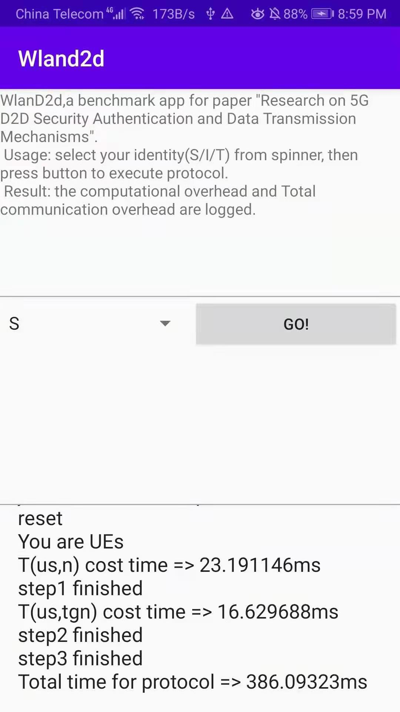

# Overview
This repository hosts the source code for our paper—"Anonymity and Secure Data Transmission Mechanism with Trajectory Tracking in Device-to-Device (D2D) Relay Communication"，it consists of three parts:5GC-amf(the AMF logic),Wland2d(the main android app) and dependency(some dependent packages)

# Usage
The basic usage is as follow:

1. You need to build and install the Wland2d application on three D2D devices, and you need to manually modify the IP address of AMF when building (the corresponding variable is AMF\_IP, in our configuration, AMF\_IP is 192.168.1.107 ).
2. After the Android app is installed, run Amf.java on the computer firstly(it listens on port 4000), and then run Wland2d on the three devices in turn, and select the corresponding identity (for example, the source device should be 'S', the relay device should be 'I', and the target device should be 'T'). After selecting the identity, the devices will automatically complete the registration  and execute the protocol.
3. Finally, the source device will display the computational cost and execution time of the protocol.

# Testbed
The Testbed is as follow:  

- Sender: Huawei P10 with Kirin 960 Octa Core processor,4GB RAM
- Relay: Honor Tablet 2 with Snapdragon 425 Quad core processor,2GB RAM
- Target Device: MI 11 with Snapdragon 888 Octa Core processor,8GB RAM.
- AMF: Intel Core i5-7200U processor and 8GB RAM.

This data transmission scheme can be executed in the WLAN environment, each transmission delay is around 300 ms.

